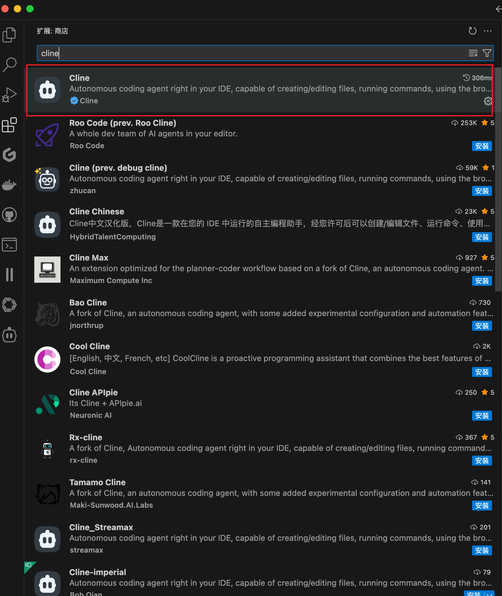
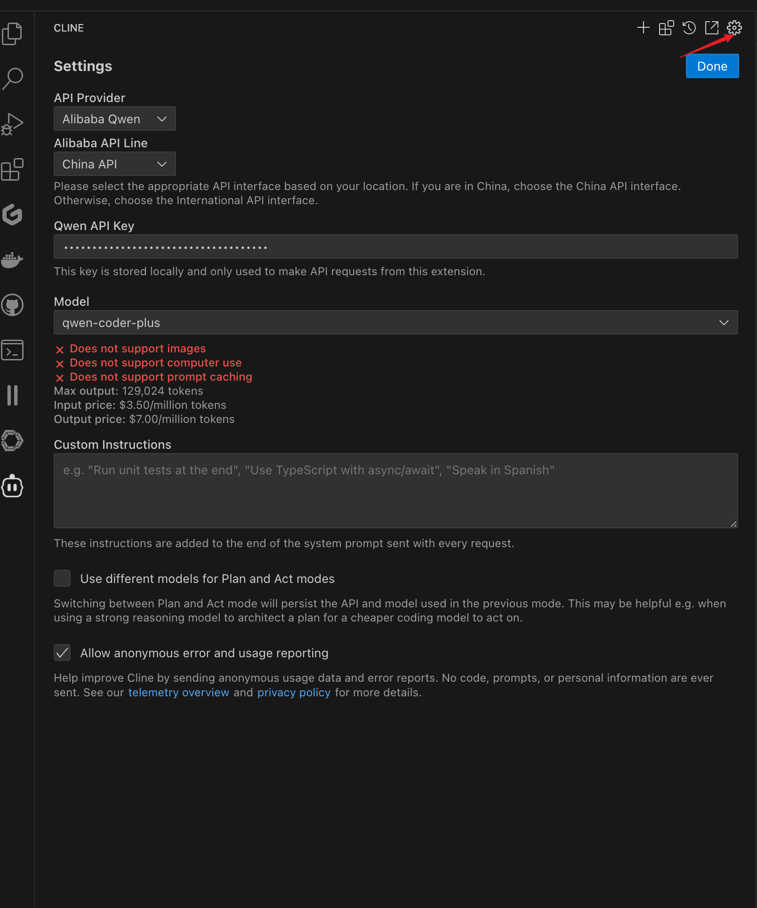
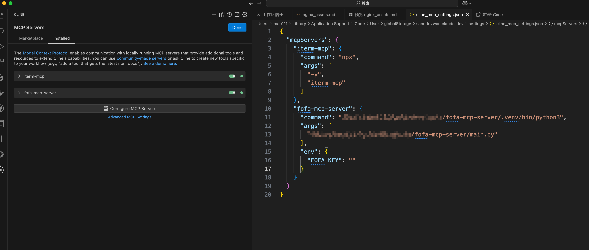
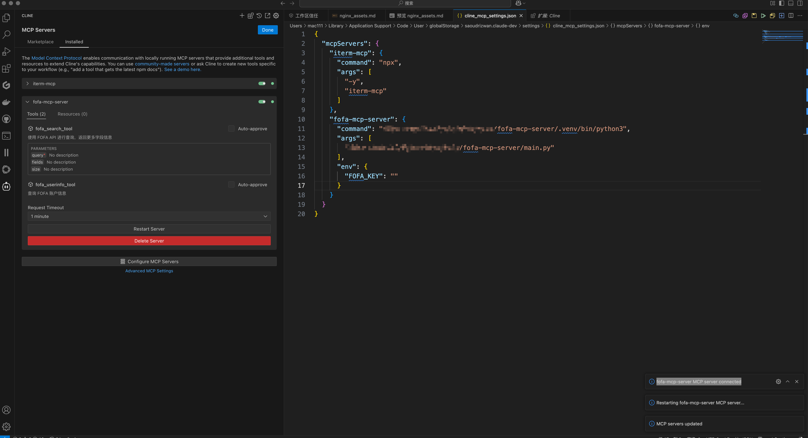

# README

# FOFA MCP Server

基于 MCP (Model Control Protocol)的 FOFA API 查询服务器，提供简单易用的 FOFA 数据查询接口。

## 功能特点

- 支持 FOFA API 的基础查询功能
- 提供完整的字段信息查询选项
- 支持查询账户信息
- 基于异步 HTTP 客户端，性能优异
- 使用 MCP 协议，便于与其他系统集成

## 环境要求

- Python >= 3.11
- FOFA API 密钥
- cline

## 安装

1. 克隆项目到本地：

```bash
git clone https://github.com/intbjw/fofa-mcp-server.git
cd fofa-mcp-server
```

1. 安装依赖：

```bash
pip install -r requirements.txt
```

或者使用 Poetry：

```bash
poetry install
```

## 配置

1. 下载插件

使用 cline 进行配置，在 vscode 中下载插件



1. 进行模型配置



我这里选择的阿里云的qwen-coder，也可以使用本地大模型。

1. 配置fofa-mcp-server


编写配置文件



```json
{
  "mcpServers": {
    "fofa-mcp-server": {
      "command": "python3",
      "args": [
        "/path/to/fofa-mcp-server/main.py"
      ],
      "env": {
        "FOFA_KEY": "API KEY"
      }
    }
  }
}
```

提示`fofa-mcp-server MCP server connected` 配置成功



## 使用演示

[2025-03-14 17-49-49.mp4](<video/2025-03-14 17-49-49_RUHw6_vWid.mp4>)

## API 说明

### 1. FOFA 查询

```python
fofa_search_tool(query: str, fields: str = "", size: int = 50) -> dict
```

参数说明：

- `query`: FOFA 查询语句
- `fields`: 查询字段，可选值：
    - ""（默认）：返回基础字段信息
    - "all"：返回所有可用字段信息
- `size`: 返回结果数量，默认 50 条

返回数据格式：

```python
{
    "summary": str,  # 查询统计信息
    "data": List[Dict]  # 查询结果列表
}
```

### 2. 查询账户信息

```python
fofa_userinfo_tool() -> dict
```

返回 FOFA 账户的详细信息。

## 字段说明

### 基础字段（默认）

- IP
- 端口
- 协议
- 主机名
- 域名
- ICP 备案号
- 网站标题
- 产品名
- 版本号
- 最后更新时间

### 完整字段（fields="all"）

包含基础字段，以及：

- 国家代码
- 国家名
- 地区
- 城市
- 经度
- 纬度
- ASN 编号
- ASN 组织
- 操作系统
- 服务器
- JARM 指纹
- Header
- Banner
- 基础协议
- URL 链接
- 证书相关信息
- JA3S 指纹
- TLS 版本
- 产品分类
- 域名 CNAME

## 注意事项

1. 请确保 FOFA API 密钥有效且具有足够的查询权限
2. 注意遵守 FOFA 的 API 使用限制和规范
3. 建议合理设置查询结果数量，避免消耗过多积分

## TODO

- [x] 查询账号信息
- [x] 执行用户输入语句
- [ ] 支持大模型生成查询语句
- [ ] 模糊语句查询

## 许可证

## 贡献

欢迎提交 Issue 和 Pull Request！
